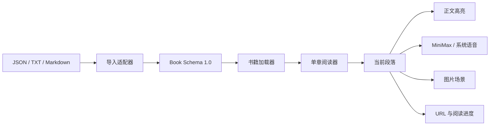

# 实现原理与架构

## 1. 产品模型

史境不是“把文字截图成图片后播放”，而是让同一个阅读位置同时驱动正文、声音、画面、路由和进度。

核心状态只有四个坐标：`bookId → chapterId → segmentId → mode`。所有用户操作最终都修改这组坐标，其他界面只是它的投影，因此点击段落、自动续播、目录跳转和重新打开不会各自维护一套互相冲突的状态。

## 2. 数据层

### 标准书籍

`docs/demos/shijing-dayu-immersive/books/book-schema.json` 是唯一规范格式，包含：

- 书籍元信息；
- 章节及章节收束；
- 可独立选择的段落；
- 原文、讲解、故事、史料等叙事模式；
- 每种模式对应的正文与可选音频；
- 章节或段落对应的可选图片。

内置书与用户导入书最终都会归一化成同一个对象，阅读器不关心它最初来自 JSON、TXT、Markdown、CMS 还是未来的 EPUB 解析器。

### 加载顺序

`book-loader.js` 启动时：

1. HTTP 环境从 `books/*.json` 加载内置书；
2. `file://` 直开时使用 `history-data.js` 兼容包；
3. 从 IndexedDB 读取用户导入书；
4. 校验、去重并合并为当前书架。

TXT 与 Markdown 适配器识别标题、章节标题和空行段落；无法提供媒体的原始文稿自动生成一个“原文阅读”模式。

## 3. 阅读与同步

阅读器一次只挂载当前章，避免厚书把全部 DOM、图片和音频同时装入页面。段落成为最小同步单位：

- 选择段落后更新 `segmentIndex`；
- 左侧切换活动段和可见正文；
- 右侧切换对应图片及说明；
- 路由替换为可分享的书/章/段/模式地址；
- 播放时加载该段当前模式的音频；
- 定时保存当前音频秒数和阅读历史。

段落结束后进入下一段；章节末显示收束卡。用户主动听读时可以倒计时进入下一章，但“本段结束”或“本章结束”的朗读定时拥有更高优先级。

## 4. 语音路径

内置书使用离线生成的 MiniMax `speech-2.8-hd` MP3。网页只播放本地静态文件，不包含 API 密钥，也不会在浏览器中直接调用 MiniMax。

当标准书没有音频，或音频加载失败时，播放器降级到浏览器 `SpeechSynthesis`：

- 状态明确显示“系统语音”；
- 段落选择、自动续章和朗读定时仍然工作；
- 不把系统语音伪装成 MiniMax 高清音频。

## 5. 本地状态

| 数据 | 存储 | 作用 |
| --- | --- | --- |
| 每本书阅读位置、模式、音频秒数、历史 | `localStorage / shijing-reader-state-v2` | 刷新和重新打开后继续 |
| 每日阅读计划与今日时长 | `localStorage / shijing-reading-plan-v1` | 计划、提醒与进度 |
| 用户导入的标准书对象 | `IndexedDB / shijing-local-library` | 容纳比 localStorage 更大的书籍正文 |
| 朗读睡眠定时 | 内存 | 返回展厅或刷新即失效，避免过期定时误触发 |

所有数据默认只在当前浏览器保存；没有账号、服务端数据库或跨设备同步。

## 6. 运行与安全边界

- 纯静态 HTML/CSS/JavaScript，无构建步骤、后端或运行时密钥。
- 导入文件最大 5MB；媒体应以静态相对路径或受控 URL 提供。
- 导入文字进入 HTML 前统一转义，避免把用户文本当作页面标记执行。
- 浏览器通知只在用户主动操作后申请权限。
- 纯静态页面无法承诺浏览器完全关闭后的后台提醒。
- `file://` 可阅读内置书，但本地导入能力取决于浏览器是否允许 IndexedDB。

## 7. 主要代码

| 文件 | 职责 |
| --- | --- |
| `books/book-schema.json` | 通用书籍协议 |
| `books/book-template.json` | 最小可导入样例 |
| `book-loader.js` | 校验、文本适配、IndexedDB 与内置书加载 |
| `app.js` | 路由、阅读状态、播放、续章、定时、计划和导入交互 |
| `styles.css` | 展厅、左右阅读、移动场景条、主题和弹层 |
| `history-data.js` | `file://` 兼容数据包 |

