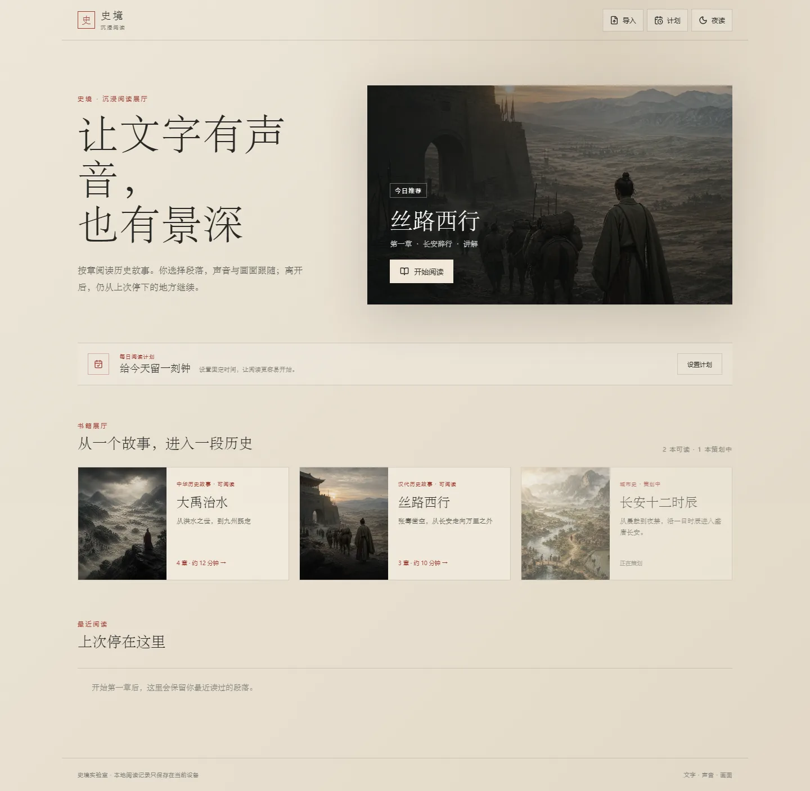
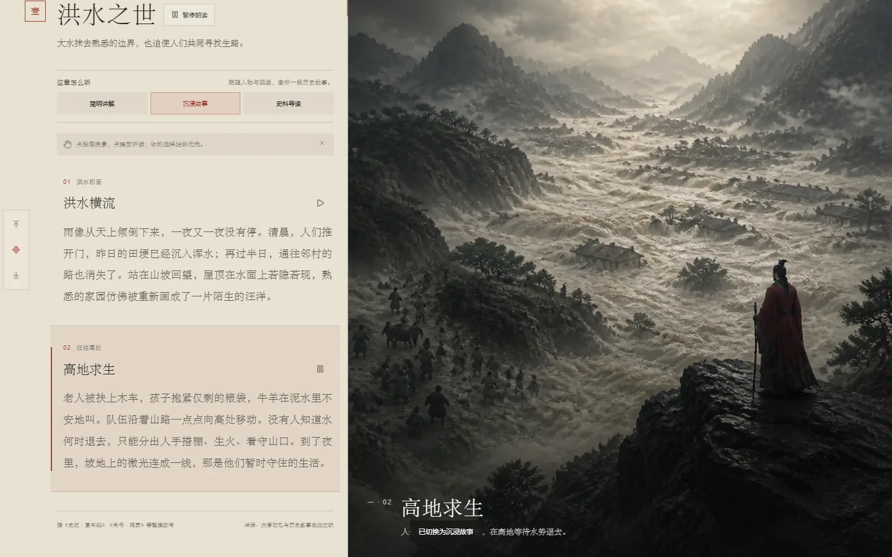
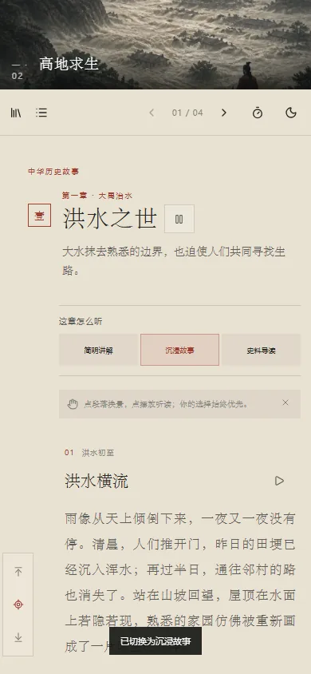

# 史境 · 沉浸式历史阅读

一个完整的“可导入书籍展厅 + 单章沉浸阅读 + MiniMax 多模式旁白 + 随文换景”产品样例。桌面端保持左侧阅读、右侧画面；手机端在朗读时保留紧凑场景条，让声音、文字与画面不脱节。核心内容协议是版本化 Book JSON，不依赖 ZIP 包。

[打开在线演示](https://yydshly.github.io/0822_githubcode_study/demos/shijing-dayu-immersive/) · [实现原理](ARCHITECTURE.md) · [书籍格式](BOOK_FORMAT.md) · [扩展路线](ROADMAP.md) · [部署说明](DEPLOYMENT.md) · [浏览器验证](VALIDATION.md)

## 当前成品

- 默认进入书籍展厅：首次用户看到按日期稳定轮换的“今日推荐”，回访用户看到最近一本“从这里继续”、按书去重的最近阅读和独立进度。
- 两本书真实可读：《大禹治水》4章8段、《丝路西行》3章6段；《长安十二时辰》保留为明确的策划中内容，不伪装成入口。
- 展厅顶栏提供紧凑“导入”入口：标准 Book JSON 直接校验，TXT/Markdown 经适配器自动整理为章和段，统一保存到 IndexedDB；刷新后仍在当前设备可读。
- 导入文件没有音频或画面时不伪装成完整制作：界面显示文字场景占位，朗读明确使用浏览器系统语音；后续可在同一 Book JSON 中补充 MiniMax 音频及图片/视频引用。
- 导入管理支持空态、成功/错误状态、5MB上限、同名ID自动避让和两步移除；提供可下载标准模板，不要求用户先制作 ZIP。
- 内容层级为“展厅 → 书籍 → 章节 → 段落”；阅读器一次只装载一章的两个段落，适合继续扩展成长书。
- 十四个段落各有“简明讲解、沉浸故事、史料导读”三套独立正文和匹配的 MiniMax `speech-2.8-hd` MP3，共 42 条本地音频。
- 七章各对应一幅本地电影感历史画面；同章段落使用不同说明，切换时保持克制的淡入和轻微镜头推进。
- 桌面左栏正文会随栏宽扩展：1440px 下正文主体约 518px、两侧仅保留 22px；既提高空间利用率，也把中文行长控制在适合连续阅读的范围。
- 点击段落先改变阅读焦点和画面；点击段落旁的小播放键开始朗读。
- 朗读进行中，点击任何其他段落都会立刻停止旧语音，从该段重新朗读；段落高亮、右侧画面、隐式侧边轨迹和网址锚点同时更新。
- 段内自动续播；章末出现本章收束与下一章预告。用户主动朗读时 5 秒后自动续章，也可“停在这里”或立即继续；末章完成后返回展厅。
- 顶栏提供轻量朗读定时：15/30 分钟、本段结束或本章结束；分钟到点会保存当前秒数，段末/章末定时会优先阻断自动续播。
- 分钟定时最后 8 秒会让 MiniMax 旁白和已开启的环境声平滑渐弱；取消、改期或再次播放会恢复正常音量。
- 每本书分别保存当前章、段落、模式、音频秒数和已读章节；刷新或重新打开可继续，旧版单书记录会自动迁移。
- 展厅可建立每日阅读计划：设置每天/工作日/周末、提醒时间和10/15/30分钟目标；前台阅读时长形成今日进度，到时未完成会站内提醒。
- 浏览器通知只在用户点击“允许提醒”后申请；纯静态网页不承诺浏览器完全关闭后的后台准时推送。
- “播放当前段落”紧跟主标题同排，不再额外占据一行；左侧三枚轻量图标可随时回到文首、定位当前朗读段或跳到文末，定位不会打断音频。
- 章节目录可直接进入任一章或任一段；日/夜阅读、轻量环境声、只看画面和浏览器全屏均可用。
- 390×844 手机初始为 320px 上景下文；播放后画面收为 112px 粘性场景条，下方正文自然滚动；没有遮挡正文的固定底栏。
- MiniMax 音频加载失败时自动退回系统语音；图片加载失败时显示当前画面的文字说明。
- 无构建、无后端、无外部网络依赖，并支持直接双击 `index.html` 打开。

## 效果预览

### 书籍展厅



### 桌面左文右景听读



### 移动端播放态



## 运行

直接打开：

```text
docs/demos/shijing-dayu-immersive/index.html
```

或在仓库根目录启动本地服务器：

```powershell
python -m http.server 8107 --directory docs
```

然后访问：

```text
http://127.0.0.1:8107/demos/shijing-dayu-immersive/
```

## 运行结构

```text
docs/demos/shijing-dayu-immersive/
├─ index.html          # 展厅、左文右景阅读器与章末完成卡
├─ styles.css          # 展厅/阅读排版、响应式、主题和转场
├─ books/              # Book Schema、标准模板、内置书JSON与目录
├─ book-loader.js      # 格式校验、TXT/MD适配、IndexedDB本地书库
├─ history-data.js     # file:// 直开兼容数据包
├─ app.js              # 多书路由、导入管理、恢复、续章、MiniMax队列和回退
├─ assets/audio/       # 42 条 MiniMax MP3 与生成清单
├─ assets/story/       # 七幅本地 WebP 历史画面
└─ vendor/lucide.min.js# 本地图标库
```

音频由 `projects/shijing-dayu-immersive/generate-minimax-audio.mjs` 离线生成。API 密钥只从本机环境读取，不会被写入网页或音频清单。

## 内容与许可边界

- 页面文字根据《史记·夏本纪》《尚书·禹贡》《史记·大宛列传》《汉书·张骞李广利传》等主题方向整理改写，不引用现代《上下五千年》版本正文。
- 大禹治水包含历史记忆、古代文献整理与后世传说，正文明确不把它当成可完全考证的实录。
- 七幅画面是为本样例生成的原创资产；没有复制 GatelessGate 的文章、应用源码、美术或声音。
- Lucide 用作一致的界面图标；许可文本随 `vendor/LUCIDE-LICENSE` 保留。

## 扩展路线

要扩展成《上下五千年》式内容产品，优先持续维护 `books/book-schema.json` 这一份通用格式；EPUB、DOCX、CMS 或 AI 内容加工都只需增加“输入 → Book JSON”的适配器，阅读器无需重构。后续可再加入媒体资产上传、账号同步、收藏、时间线、视频片段与专业史料审校。当前样例已完成单设备闭环：导入/发现书籍、按章阅读、选择讲述方式、继续上次位置、查看历史并自动续章。

完整的阶段划分、内容生产流水线和正式产品基础设施见 [ROADMAP.md](ROADMAP.md)。
