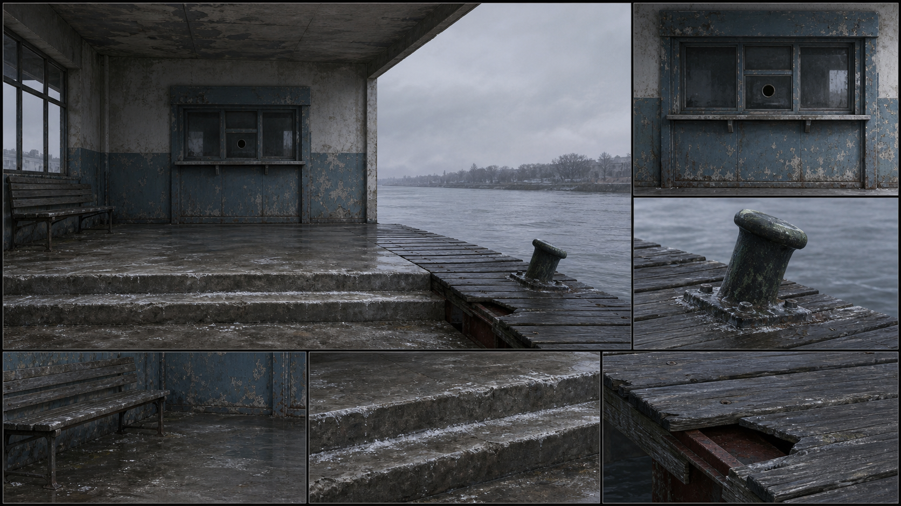
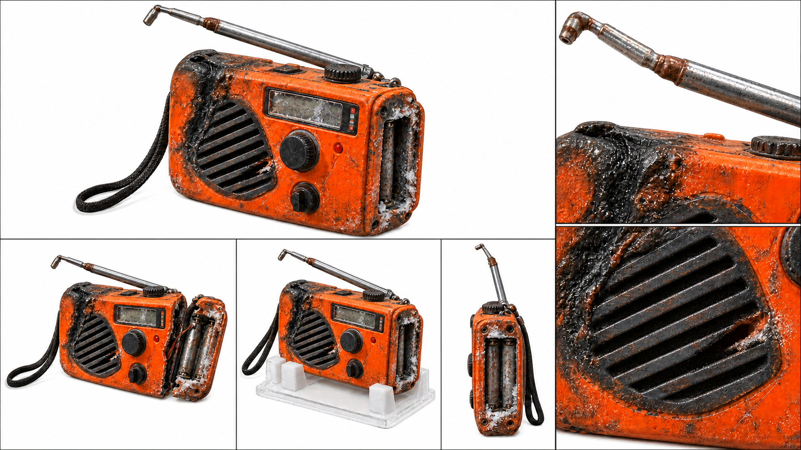
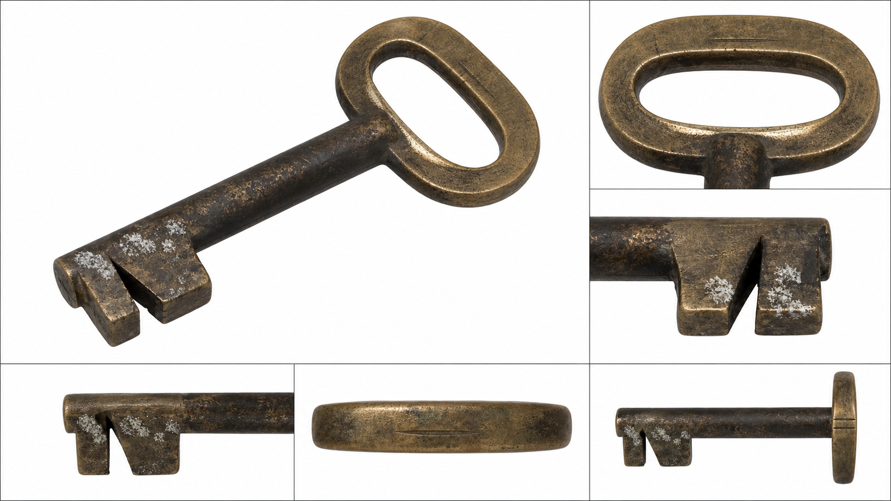

# 潮痕 · 美术设定集

> 画风：半写实厚涂

## 场景清单

| ID | 场景 | 类型 | 出现集 | 锚点 | 光照 | 变体 |
| --- | --- | --- | --- | --- | --- | --- |
| S01 | 南堤旧渡口候船厅与栈桥 | 主场景 | 1、4、6 | 4 | 阴天上午、夜间逼问、仪式清晨、退潮黄昏 | — |
| S02 | 许知遥临时声音修复室 | 主场景 | 1、2、3、5 | 4 | 凌晨修复、阴天工作日、退潮前夜 | — |
| S03 | 旧渡口货仓 | 主场景 | 2、3、4 | 4 | 阴天下午、单灯夜戏 | — |
| S04 | 沉船点外侧防波堤 | 变体 ← S01 | 5 | 4 | 夜间退潮 | 沿用 S01 的灰蓝水岸、旧混凝土材质、双潮痕语言与远岸灯光方位；改为夜间退潮并降低水位，以交叠消波块和锈环固定点替换候船厅与栈桥前景。 |

---

## S01 南堤旧渡口候船厅与栈桥

作为旧案从私人伤口转为公共证词的主舞台，空间必须同时容纳废弃感、拆除倒计时和最终公开对峙；候船厅的封闭阴影与伸向水面的栈桥形成从压抑走向揭露的视觉路径。



### 一致性锚点

1. **锈蓝售票窗** — 候船厅正墙中央是一扇褪成灰蓝色的金属售票窗，卷帘漆皮大片翘起，左下角留有矩形告示撕痕。
2. **双潮痕石阶** — 通往水面的旧混凝土台阶最低两级各留一道深浅不同的盐白水线，边缘被潮水磨圆。
3. **断口栈桥板** — 灰黑木栈桥靠岸第七块踏板右缘断去三角缺口，缺口下露出锈红钢梁。
4. **歪斜系缆柱** — 栈桥外侧立着一根向江面倾斜的矮铸铁系缆柱，顶部覆有青绿锈斑，基座周围结着盐霜。

### 光照与时段

- **阴天上午**：`Cold overcast morning at an abandoned riverside ferry terminal, broad soft light from the water, muted blue-grey concrete, damp timber, low contrast, an empty scene with no people.`
- **夜间逼问**：`Deep blue night at the abandoned ferry terminal, one weak amber utility lamp above the ticket window, wet stone steps reflecting a narrow strip of light, dark river beyond, empty scene, no people or silhouettes.`
- **仪式清晨**：`Clear pale morning at the old ferry terminal, hard lateral sunlight revealing chipped paint and salt stains, a brighter open forecourt against the shadowed waiting hall, empty scene without people.`
- **退潮黄昏**：`Quiet blue-gold dusk at low tide, warm last light grazing the two tide marks on the concrete steps, cool river haze and distant shore lights emerging, empty scene with no human presence.`

### 出图提示词包

**主视角 EN**

```text
Master wide view of an abandoned small-town riverside ferry terminal combining a weathered waiting hall and a short timber jetty. Center the chipped blue-grey metal ticket window, lead the eye down concrete steps marked by two distinct tide lines, across the seventh jetty plank with a triangular broken edge, toward a leaning patinated mooring bollard. Cold overcast morning, grey-blue river, distant shore haze. Empty scene, no people, no human figures, no silhouettes. Semi-realistic painterly environment concept art with grounded architectural perspective and weathered materials.
```

**反向提示词**

```text
people, human figures, characters, crowds, silhouettes of people, vehicles, construction machinery, plastic CG look, oversaturated colours, sterile showroom cleanliness, warped perspective, melted geometry, floating objects, text, watermark, signature
```

**设定图 EN**

```text
Create a 16:9 environment design sheet for one abandoned riverside ferry terminal. Use an L-shaped layout with a master view in the upper left taking about 72 percent width and 70 percent height, two detail panels in the right column, and three detail panels along the bottom. The master view shows the waiting hall and short jetty in a cold overcast morning: the chipped blue-grey ticket window, concrete steps with two tide lines, the seventh plank with a triangular broken edge, and the leaning patinated mooring bollard. Every detail panel must be a close crop from this exact master space. THE SPACE MUST BE IDENTICAL ACROSS ALL PANELS. Nothing invented that is not present in the master view. Absolutely no people anywhere. Semi-realistic environment concept art, painterly rendering with visible brush texture, grounded architectural perspective, cinematic depth. Weathered, lived-in materials: chipped paint, water stains, patina on metal, worn wood grain, dust in corners and light shafts; fabric and paper props show creases and age; nothing looks factory-new. Atmospheric depth with haze or volumetric light where the space allows.
```

`semi-realistic`, `environment sheet`, `painterly`, `weathered materials`, `cinematic`

---

## S02 许知遥临时声音修复室

这是把听不见的真相转化为可见证据的高压工作舱；狭窄台面、老旧隔音材料和被潮气侵入的设备让每一次修复都像在与拆迁时限抢时间。

### 一致性锚点

1. **灰绿修复台** — 房间中央是一张窄长灰绿色钢制工作台，前缘漆面磨出连续银亮露底，电缆从右侧圆孔整齐下垂。
2. **错格吸音毡** — 后墙贴着十二块深灰吸音毡，其中右上两块错位下坠并带褐色水渍，形成固定的不规则轮廓。
3. **双层波形屏** — 工作台左后方叠放两台不同年代的显示器，上屏窄而厚、下屏宽而薄，屏面只显示无文字的青色波形线。
4. **铁丝玻璃窗** — 右墙高处是一扇方形铁丝夹层玻璃窗，左下角有蛛网状裂纹，窗框积着盐白粉末。

### 光照与时段

- **凌晨修复**：`A cramped empty audio restoration room after midnight, cool cyan waveform glow from stacked monitors, one warm articulated desk lamp on a worn grey-green steel bench, deep blue wired-glass window, no people.`
- **阴天工作日**：`Soft overcast daylight filtering through cracked wired glass into an empty temporary audio lab, neutral grey-green work surfaces, restrained monitor glow, every water stain readable, no human figures.`
- **退潮前夜**：`Predawn blue darkness in an empty audio restoration room, concentrated amber task light across the steel bench, cyan waveforms reflected faintly in cracked wired glass, tense low-key contrast, no people or silhouettes.`

### 出图提示词包

**主视角 EN**

```text
Master three-quarter wide view of a cramped temporary audio restoration room. A worn grey-green steel workbench faces twelve dark acoustic felt squares with two water-stained panels sagging out of alignment. Two stacked monitors of different eras display abstract cyan waveforms with no readable text. A high wired-glass window has a spider crack in its lower left corner. Midnight lighting from one warm articulated desk lamp and cool screens. Empty scene, no people, no human figures, no silhouettes. Semi-realistic painterly environment concept art, grounded perspective, aged technical equipment and damp lived-in surfaces.
```

**反向提示词**

```text
people, human figures, characters, crowds, silhouettes of people, hands, faces, readable text, duplicate monitors, plastic CG look, oversaturated colours, sterile showroom cleanliness, warped perspective, melted geometry, floating objects, watermark, signature
```

**设定图 EN**

```text
Create a 16:9 environment design sheet for one cramped temporary audio restoration room. Use an L-shaped layout with a master view in the upper left taking about 72 percent width and 70 percent height, two detail panels in the right column, and three detail panels along the bottom. The master view uses midnight lighting from a warm articulated desk lamp and cool cyan monitor glow. It must show the worn grey-green steel bench, twelve dark acoustic felt panels with two sagging water-stained squares, two stacked monitors of different eras with abstract waveforms, and the cracked wired-glass window. Every detail panel is a crop of the same room and the same objects. THE SPACE MUST BE IDENTICAL ACROSS ALL PANELS. Nothing invented that is not present in the master view. Absolutely no people anywhere. Semi-realistic environment concept art, painterly rendering with visible brush texture, grounded architectural perspective, cinematic depth. Weathered, lived-in materials: chipped paint, water stains, patina on metal, worn wood grain, dust in corners and light shafts; fabric and paper props show creases and age; nothing looks factory-new. Atmospheric depth with haze or volumetric light where the space allows.
```

`semi-realistic`, `environment sheet`, `painterly`, `weathered materials`, `cinematic`

---

## S03 旧渡口货仓

货仓是被人为封住的证据腔室，设计重点不是堆满货物，而是让新换的门锁、嵌墙消防柜和周期报警器共同证明这里曾困住人，也仍藏着未被清理干净的记录。

### 一致性锚点

1. **新锁旧门** — 入口是盐蚀斑驳的深褐钢门，却装着一只明显较新的银色方形挂锁，新旧反差一眼可辨。
2. **嵌墙消防柜** — 左侧混凝土墙脚嵌着矮小红色消防柜，柜门褪成暗砖红，右下铰链变形并留有一圈水泥补痕。
3. **琥珀报警器** — 后墙横梁下固定着圆角方形防潮报警器，乳白外壳发黄，中央只有一粒琥珀色指示灯。
4. **弧形排水沟** — 水泥地面有一道从消防柜前绕向门口的浅弧排水沟，沟底积着黑色淤泥和盐白结晶。

### 光照与时段

- **阴天下午**：`Dim overcast afternoon inside an empty riverside warehouse, cold diffuse light entering through the partly open steel door, a weak amber moisture-alarm indicator, deep grey concrete and readable salt deposits, no people.`
- **单灯夜戏**：`Night inside an empty abandoned warehouse, one harsh utility lamp above the old steel door casting long angular shadows toward the embedded fire cabinet, tiny amber alarm light, no human figures or silhouettes.`

### 出图提示词包

**主视角 EN**

```text
Master wide interior of a nearly empty abandoned ferry warehouse. Frame a salt-corroded dark brown steel door fitted with a conspicuously new square silver padlock, a faded brick-red fire cabinet embedded low in the left concrete wall, a yellowed moisture alarm with one amber indicator beneath the rear beam, and a shallow curved drainage channel carrying black silt and white salt crystals toward the door. Cold overcast afternoon light enters from the doorway. Empty scene, no people, no human figures, no silhouettes. Semi-realistic painterly environment concept art with grounded industrial perspective and damp weathered surfaces.
```

**反向提示词**

```text
people, human figures, characters, crowds, silhouettes of people, stacked cargo, barrels, readable text, plastic CG look, oversaturated colours, sterile showroom cleanliness, warped perspective, melted geometry, floating objects, watermark, signature
```

**设定图 EN**

```text
Create a 16:9 environment design sheet for one nearly empty abandoned riverside warehouse. Use an L-shaped layout with a master view in the upper left taking about 72 percent width and 70 percent height, two detail panels in the right column, and three detail panels along the bottom. The master view uses cold overcast afternoon light through a dark steel door and shows the new square silver padlock, the embedded faded red fire cabinet, the yellowed moisture alarm with one amber light, and the shallow curved floor drain with black silt and salt crystals. Every detail panel must be a close crop from the same master view. THE SPACE MUST BE IDENTICAL ACROSS ALL PANELS. Nothing invented that is not present in the master view. Absolutely no people anywhere. Semi-realistic environment concept art, painterly rendering with visible brush texture, grounded architectural perspective, cinematic depth. Weathered, lived-in materials: chipped paint, water stains, patina on metal, worn wood grain, dust in corners and light shafts; fabric and paper props show creases and age; nothing looks factory-new. Atmospheric depth with haze or volumetric light where the space allows.
```

`semi-realistic`, `environment sheet`, `painterly`, `weathered materials`, `cinematic`

---

## S04 沉船点外侧防波堤

作为 S01 水岸资产的危险侧面变体，这里把公共渡口的可见秩序压低到夜间退潮后的湿滑边界，让打捞行动发生在熟悉水色与远岸灯火下，却被消波块前景推向未知深处。

### 一致性锚点

1. **双潮痕混凝土** — 沿用 S01 深浅两道盐白潮线，但落在防波堤倾斜的旧混凝土坡面上，退潮后完整露出。
2. **交叠消波块** — 前景三枚灰黑四脚消波块交错叠放，中间一枚右上角崩缺并露出浅色骨料。
3. **锈环固定点** — 坡面左下嵌着一只厚重圆形铁环，锈迹向下拖成扇形，作为下水绳索的固定位置。
4. **远岸三灯** — 灰蓝江面远处固定排列三点暖黄岸灯，中间一盏略低，保持与 S01 相同的远岸方位。

### 光照与时段

- **夜间退潮**：`Low-tide night at a deserted breakwater, deep cobalt ambient light, wet concrete and interlocking wave breakers catching narrow silver highlights, three fixed warm lights on the far shore, black receded water, no people or silhouettes.`

> 变体来源：S01　改动：沿用 S01 的灰蓝水岸、旧混凝土材质、双潮痕语言与远岸灯光方位；改为夜间退潮并降低水位，以交叠消波块和锈环固定点替换候船厅与栈桥前景。

### 出图提示词包

**主视角 EN**

```text
Variant master view derived from the same grey-blue riverbank, aged concrete, tide-line pattern and far-shore lighting as the old ferry terminal asset. Change to night at low tide and replace the waiting hall and timber jetty foreground with layered dark concrete wave breakers. Show two exposed salt-white tide lines on the sloped concrete, three interlocking tetrapods with one chipped upper corner, a heavy rusted rope ring at lower left, and three warm far-shore lights with the middle light slightly lower. Empty scene, no people, no human figures, no silhouettes. Keep the materials, wear language and shore orientation identical to the parent environment.
```

**反向提示词**

```text
people, human figures, characters, crowds, silhouettes of people, boats, divers, waiting hall, timber jetty, plastic CG look, oversaturated colours, sterile showroom cleanliness, warped perspective, melted geometry, floating objects, text, watermark, signature
```

**设定图 EN**

```text
Create a 16:9 environment design sheet for one low-tide night breakwater variant, using the parent ferry-terminal image as structural and material reference. Use an L-shaped layout with a master view in the upper left taking about 72 percent width and 70 percent height, two detail panels in the right column, and three detail panels along the bottom. Preserve the grey-blue water, aged concrete, salt-white tide-line language and three far-shore lights from the parent asset. Replace the hall and jetty foreground with three interlocking dark wave breakers, one chipped corner, and a rusted rope ring. THE SPACE MUST BE IDENTICAL ACROSS ALL PANELS. Nothing invented that is not present in the master view. Keep the structure, materials and wear identical to the reference image. Absolutely no people anywhere. Semi-realistic environment concept art, painterly rendering with visible brush texture, grounded architectural perspective, cinematic depth. Weathered, lived-in materials: chipped paint, water stains, patina on metal, worn wood grain, dust in corners and light shafts; fabric and paper props show creases and age; nothing looks factory-new. Atmospheric depth with haze or volumetric light where the space allows.
```

`semi-realistic`, `environment sheet`, `painterly`, `weathered materials`, `cinematic`

---

## 道具清单

| ID | 道具 | 尺度 | 状态 | 关联场景 | 出现集 | 锚点 |
| --- | --- | --- | --- | --- | --- | --- |
| P01 | 橙色应急电台 | 手持级 | 烧损待修复、摔裂毁证、归档保存 | S01、S02、S03 | 1、2、3、4、5、6 | 4 |
| P02 | 黄铜船钥匙 | 手持级 | 遗物原状 | S01、S03 | 1、2、3 | 4 |
| P03 | 真正的载货联单 | 桌面级 | 水下取回、修复展平、现场公开 | S01、S02、S04 | 5、6 | 4 |

---

## P01 橙色应急电台

保存许潮现场录音，是逐集解锁真相、承受反派毁证并在结尾转入永久档案的核心证据。



### 一致性锚点

1. **烧融黑痕** — 橙色外壳左上角有一道向扬声器边缘流下的焦黑熔痕，边界呈不规则泪滴状。
2. **盐霜电池仓** — 背面电池仓盖缺失，仓内触点和边缘覆盖颗粒明显的白色盐霜。
3. **斜纹扬声格** — 正面下半部为黑色斜纹扬声器格栅，其中第三道横格在右侧断开。
4. **弯顶天线** — 银色伸缩天线只剩两节，顶端向左弯出约二十度并带暗褐氧化圈。

### 状态变体

- **烧损待修复**：`A compact orange emergency radio at handheld scale, fire-scarred but still assembled, black melted streak on the upper left shell, open battery compartment packed with white salt frost, broken grille line and bent two-section antenna, isolated with no hands.`
- **摔裂毁证**：`The same compact orange emergency radio at handheld scale after a hard impact, shell split along the right seam, storage board broken into two aligned fragments, original black melt scar and salt-frost battery compartment unchanged, isolated with no hands.`
- **归档保存**：`The same damaged orange emergency radio at handheld scale preserved without cosmetic repair, cracked shell held in archival supports, black melt scar and salt frost fully visible, no added restoration, isolated with no hands or labels.`

### 出图提示词包

**主视角 EN**

```text
Three-quarter product reference of one compact orange emergency radio at handheld scale, fire-scarred but assembled. Show the black teardrop-shaped melt streak on the upper left shell, open battery compartment with granular white salt frost, black diagonal speaker grille with the third bar broken at right, and a two-section silver antenna bent left at the tip. Pure white background, cut-out ready, no people, no hands, no fingers. Semi-realistic painterly prop concept art with precise aged materials.
```

**反向提示词**

```text
people, human figures, characters, crowds, hands, fingers, arms, faces, holding pose, duplicate object, extra antenna, readable text, coloured background, grey background, transparent background, plastic CG look, oversaturated colours, sterile showroom cleanliness, warped perspective, melted geometry, floating objects, watermark, signature
```

**设定图 EN**

```text
Create a 16:9 prop design sheet for one compact orange emergency radio at handheld scale. Every panel must use a pure white background and remain cut-out ready. Use an L-shaped layout: a three-quarter master view of the fire-scarred assembled state in the upper left, two anchor close-ups in the right column, and bottom panels for the cracked impact state, archival support state, and one side orthographic view. Keep the black melt streak, salt-frost battery compartment, broken third grille bar and bent two-section antenna identical in every panel. THE OBJECT MUST BE IDENTICAL ACROSS ALL PANELS. Nothing invented that is not present in the master view. Absolutely no people, hands or fingers anywhere. Semi-realistic environment concept art, painterly rendering with visible brush texture, grounded architectural perspective, cinematic depth. Weathered, lived-in materials: chipped paint, water stains, patina on metal, worn wood grain, dust in corners and light shafts; fabric and paper props show creases and age; nothing looks factory-new. Atmospheric depth with haze or volumetric light where the space allows.
```

---

## P02 黄铜船钥匙

既开启隐藏值班日志，又以正钥匙被父亲夺走这一事实证明他曾阻止开船，是父亲清白从声音证词转为实体证据的枢纽。



### 一致性锚点

1. **椭圆船环** — 钥匙头是厚实的扁椭圆黄铜环，内孔下缘被长期摩擦磨成偏亮的平直段。
2. **发黑盐斑** — 钥匙柄大面积氧化为黑褐色，靠近齿部残留三片不规则盐白斑。
3. **偏心三角缺口** — 钥匙齿列中央有一个向左偏的深三角缺口，是与消防柜锁芯匹配的主要识别特征。
4. **横向咬痕** — 椭圆环外缘相对位置留有两道浅而平行的横向压痕，特写中可辨但不夸张。

### 状态变体

- **遗物原状**：`One old brass boat key at handheld scale in its inherited evidence state, heavily darkened by oxidation, three salt-white patches near the teeth, thick oval bow with two subtle parallel pressure marks, and one off-center triangular notch in the bit, isolated with no hands.`

### 出图提示词包

**主视角 EN**

```text
Three-quarter macro product reference of one old brass boat key at handheld scale. Show a thick flattened oval bow with a polished lower inner edge, black-brown oxidation across the shaft, three irregular salt-white patches near the teeth, one off-center triangular notch in the bit, and two subtle parallel pressure marks on the outer bow. Pure white background, cut-out ready, no people, no hands, no fingers. Semi-realistic painterly prop concept art with precise patina and worn metal.
```

**反向提示词**

```text
people, human figures, characters, crowds, hands, fingers, arms, faces, holding pose, key ring, duplicate keys, modern chrome key, readable text, coloured background, grey background, transparent background, plastic CG look, oversaturated colours, sterile showroom cleanliness, warped perspective, melted geometry, floating objects, watermark, signature
```

**设定图 EN**

```text
Create a 16:9 prop design sheet for one old brass boat key at handheld scale. Every panel must use a pure white background and remain cut-out ready. Use an L-shaped layout: a three-quarter master view in the upper left, two macro anchor close-ups in the right column, and bottom panels for the bit profile, oval bow profile and one side orthographic view. Keep the polished lower inner bow edge, black-brown oxidation, three salt-white patches, off-center triangular tooth notch and two subtle pressure marks identical in every panel. THE OBJECT MUST BE IDENTICAL ACROSS ALL PANELS. Nothing invented that is not present in the master view. Absolutely no people, hands or fingers anywhere. Semi-realistic environment concept art, painterly rendering with visible brush texture, grounded architectural perspective, cinematic depth. Weathered, lived-in materials: chipped paint, water stains, patina on metal, worn wood grain, dust in corners and light shafts; fabric and paper props show creases and age; nothing looks factory-new. Atmospheric depth with haze or volumetric light where the space allows.
```

---

## P03 真正的载货联单

把事故船上的六桶溶剂编号与高嵩的私章连接起来，和录音互相印证后构成能够公开展示并进入正式鉴定的实体证据。

### 一致性锚点

1. **六格编号栏** — 纸面中部纵向排列六个等宽货桶编号格，墨色由上至下逐渐晕开，但六行结构始终清楚。
2. **暗紫私章** — 右下角盖着边缘缺一角的暗紫色方章，水浸后向左拖出短小晕尾。
3. **半月水线** — 纸张下半部有一道从左边缘跨至中线的褐灰半月形水渍，内外色阶明显。
4. **三折卷痕** — 纸面保留三道平行横折和向内卷曲的短边记忆，展开后仍形成固定起伏。

### 状态变体

- **水下取回**：`One waterlogged cargo manifest at tabletop scale just after recovery, tightly curled short edges, dark wet paper, three parallel fold ridges, six visible ruled serial rows, a blurred dark-purple square seal and a crescent water stain, isolated with no hands.`
- **修复展平**：`The same aged cargo manifest at tabletop scale after conservation flattening, dampness reduced but the three fold ridges, six ruled serial rows, chipped-corner purple seal and crescent water stain remain identical, isolated with no hands.`
- **现场公开**：`The same conserved cargo manifest at tabletop scale in its public evidence state, fully spread flat with all six ruled serial rows visible, the dark-purple square seal and crescent water stain unchanged, isolated with no hands or display holder.`

### 出图提示词包

**主视角 EN**

```text
Top-down three-quarter product reference of one aged cargo manifest at tabletop scale, conserved but visibly water-damaged. Show six evenly spaced ruled serial rows with abstract non-legible marks, a dark-purple square seal missing one corner and bleeding slightly left, a brown-grey crescent water stain across the lower half, three parallel fold ridges and inward-curling short edges. Pure white background, cut-out ready, no people, no hands, no fingers. Semi-realistic painterly prop concept art with precise wet-paper texture.
```

**反向提示词**

```text
people, human figures, characters, crowds, hands, fingers, arms, faces, holding pose, clipboard, frame, duplicate document, fully readable writing, extra seals, coloured background, grey background, transparent background, plastic CG look, oversaturated colours, sterile showroom cleanliness, warped perspective, melted geometry, floating objects, watermark, signature
```

**设定图 EN**

```text
Create a 16:9 prop design sheet for one aged cargo manifest at tabletop scale. Every panel must use a pure white background and remain cut-out ready. Use an L-shaped layout: a three-quarter master view of the conserved flattened state in the upper left, two anchor close-ups in the right column, and bottom panels for the wet curled recovery state, the fully spread public-evidence state, and one side profile showing the fold ridges. Keep the six ruled serial rows with non-legible marks, chipped-corner dark-purple seal, crescent water stain, three parallel folds and curling short edges identical in every panel. THE OBJECT MUST BE IDENTICAL ACROSS ALL PANELS. Nothing invented that is not present in the master view. Absolutely no people, hands or fingers anywhere. Semi-realistic environment concept art, painterly rendering with visible brush texture, grounded architectural perspective, cinematic depth. Weathered, lived-in materials: chipped paint, water stains, patina on metal, worn wood grain, dust in corners and light shafts; fabric and paper props show creases and age; nothing looks factory-new. Atmospheric depth with haze or volumetric light where the space allows.
```

