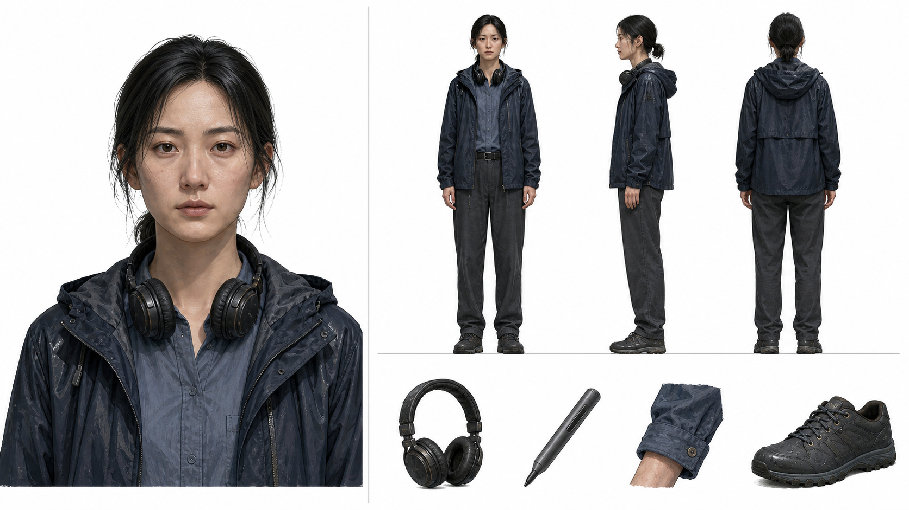

# 潮痕 — 角色表

共 5 位角色：许知遥、程野、高嵩、许德海、许潮

## 故事摘要

当代南方江镇的旧渡口即将拆除，声音修复师许知遥回乡整理已故父亲的遗物。她从一台烧损的应急电台中修出失踪哥哥的声音，并在儿时朋友程野协助下追查十五年前的沉船事故。如今掌控文旅项目的高嵩试图阻止调查，而父亲许德海和哥哥许潮只能通过遗物、录音与残存物证重新进入这场迟到的对质。

---

## 许知遥（知遥）

> 主角 · 从坏录音里追索旧案真相的声音修复师，冷静手艺之下压着对父亲十五年的怨与愧。



### 画像

- **性别**：女
- **年龄**：约三十岁（推断）
- **身份**：中国南方江镇出身的声音修复师与档案技术人员（推断）
- 克制 / 执拗 / 严谨 / 敏锐

**外貌**　身形清瘦，长时间伏案使肩背略显紧绷（推断）。鹅蛋脸，眉形利落，眼下有淡淡疲态，黑发低束；工作时戴封闭式耳机，穿灰蓝衬衫、深色直筒裤与轻薄防水外套（推断）。

**性情**　习惯先听完、核对完再作判断，动作精确，情绪越强时语气反而越稳。面对与家人有关的证据会短暂失去冷静，但很快回到可验证的事实。

**动机**　在旧渡口拆除前修复哥哥留下的录音，厘清父亲承担责任的真相，并把完整证据交给公开核验。

**人物弧光**　从把父亲的沉默视作背叛，到理解沉默背后的胁迫，并选择让证据公开接受核验。

**关系**

- 程野 — 儿时朋友与共同调查旧案的行动搭档
- 高嵩 — 她追查的旧案核心嫌疑人与当前阻挠者
- 许德海 — 已故父亲，她从怨恨走向重新理解
- 许潮 — 失踪十五年的哥哥，也是录音证据的留下者

**原文依据**

> 事故以后，知遥离开南堤，学了声音修复，专门替档案馆抢救被水和霉菌毁坏的录音。

> 知遥因此更愤怒。她一直以为父亲签责任书只是软弱，现在看来更像是在主动掩埋什么。

> 知遥没有阻拦，只告诉他，自己修复档案从来不会在原介质上工作。完整录音已经复制了三份。

### 形象

**画风**　半写实厚涂角色插画，冷灰蓝与氧化橙统一色板，现代南方江镇的潮湿质感

`semi-realistic`, `painterly`, `character sheet`, `cool grey-blue palette`, `contemporary china`, `audio restoration`

**出图提示词 · 喂出图模型用这条**

```text
Semi-realistic character illustration, painterly rendering with soft blended edges and visible brush texture, anatomically grounded. A slim East Asian woman around thirty with Han Chinese features in a contemporary 2020s southern Chinese riverside town, oval face, alert almond-shaped dark eyes, straight brows, faint under-eye fatigue, black hair tied low with loose strands. She wears a slate-blue cotton shirt, charcoal straight trousers and a lightweight dark rain jacket; studio headphones rest around her neck and a small audio-cleaning stylus is held carefully. Visible pores, uneven skin tone, faint capillaries at nostrils and ear rims, wet eye highlights, iris fibres, slightly asymmetric eyelids and brows. Fabric shows weave, cuff wear, realistic weight and fold self-shadow. Three-quarter waist-up view, plain neutral background, soft upper-left directional key with cool fill, shallow depth of field, face sharpest.
```

半写实厚涂插画：约三十岁的东亚汉族女性，身处当代中国南方江镇。身形清瘦，鹅蛋脸，深色杏眼警觉，直眉，眼下略显疲惫，黑发低束并有碎发。穿灰蓝棉衬衫、炭灰直筒裤和深色轻薄防水外套，耳机挂在颈间，谨慎拿着音频清理笔。皮肤可见毛孔与不均匀肤色，鼻翼和耳缘有细微毛细血管，眼睛有湿润高光与虹膜纤维，眼睑和眉毛略不对称。布料可见织纹、袖口磨损、真实垂坠和褶皱自阴影。四分之三视角半身，纯中性背景，左上柔和方向主光配冷调补光，浅景深，面部最清晰。

**反向提示词**

```text
plastic or waxy skin, over-smoothed airbrushed complexion, poreless doll face, perfectly symmetrical face, dead flat eyes without specular highlight, helmet-like hair with no loose strands, flat untextured fabric with no weave or wear, stiff mannequin posing, extra fingers, malformed hands, text, watermark, signature, busy or patterned background, harsh cast shadows on the backdrop
```

**角色设定图提示词 EN**

```text
Single character model sheet on ONE 16:9 landscape canvas for a slim East Asian Han Chinese woman around thirty in a contemporary 2020s southern Chinese riverside town. Divide the canvas into three zones with thin hairline rules. LEFT ZONE occupies about 34% of the canvas width: one front-facing ID-style bust portrait with BOTH SHOULDERS FULLY VISIBLE, clear side margins, and a clean straight horizontal cut below the chest; oval face, alert almond eyes, straight brows, faint under-eye fatigue, low-tied black hair with flyaways, slate-blue shirt and dark rain jacket. LIGHTING IN THE LEFT ZONE ONLY: a soft directional key light from the upper left with gentle falloff and subtle ambient occlusion under chin, eye sockets and collar. RIGHT-TOP ZONE: three FULL-BODY views of the SAME character, front, left profile and back, on one shared ground line, wearing charcoal trousers and practical waterproof shoes, headphones at the neck. Faces must match the bust portrait exactly. PROPORTIONS ARE CRITICAL: equal height and head-to-body ratio, correct anatomy and limb lengths, no stretching, squashing or foreshortening, margin above heads and below feet. LIGHTING IN THE RIGHT ZONES: flat even orthographic lighting with no directional key and no cast shadows. RIGHT-BOTTOM ZONE: four small isolated studies of the studio headphones, audio stylus, worn shirt cuff and waterproof shoe, smaller than the figures. If space is tight, continue details down the right edge; the detail studies give way, not the figures. Plain pure white background (#FFFFFF), generous even margins. Semi-realistic character illustration, painterly rendering with soft blended edges and visible brush texture, anatomically grounded. Skin with visible pores and uneven tone, wet eye highlights, slight facial asymmetry, flyaway hair; fabric with visible weave, wear and real weight.
```

### 声音

- **音色**：清晰偏冷的年轻女中音，轻微气声，咬字边缘干净
- **音高**：中音区
- **语速**：平稳偏慢，核对事实时停顿短而精确
- **口音**：标准普通话，保留很淡的南方江镇尾音（推断）
- **情绪**：克制、警觉，底层带未消退的悲伤
- **类比**：参考三十岁左右、长期做档案修复的专业女性，收音近、气息稳定

**音色提示词 · 喂 TTS 引擎用这条**

```text
30-year-old female, clear cool mezzo-soprano, mid pitch, light breath texture, focused chest-and-mask resonance, controlled dynamic range. Moderate-low volume, measured slow pace, precise short pauses, mostly level inflection. Standard Mandarin with a faint southern river-town cadence. Restrained, vigilant, quietly grieving.
```

---

## 程野

> 主角 · 熟悉江底却十五年不敢回到沉船点的潜水员，最终以一次下潜偿还迟到的证言。

### 画像

- **性别**：男
- **年龄**：约三十二岁（推断）
- **身份**：中国南方江镇潜水员，兄妹二人的儿时朋友
- 寡言 / 可靠 / 负疚 / 勇敢

**外貌**　肩背宽实、腰腹紧凑，皮肤带长期户外作业的深麦色（推断）。方脸，下颌短硬，眉浓，短发常被水汽压乱；穿磨白的深青工作夹克、速干内搭与带水渍的工装裤，手腕留有潜水表压痕（推断）。

**性情**　说话前常有较长沉默，不轻易承诺；一旦进入水边和装备操作状态，动作果断熟练。对十五年前的隐瞒始终带着明显回避。

**动机**　弥补当年丢弃船牌的过错，帮助儿时朋友找到能独立印证录音的水下物证。

**人物弧光**　从因童年恐惧隐瞒船牌，到重新潜入事故点取回关键联单。

**关系**

- 许知遥 — 儿时朋友，也是他决定协助查案的搭档
- 许潮 — 儿时伙伴，其失踪让他背负多年愧疚（推断）
- 许德海 — 曾要求他丢弃船牌的长辈
- 高嵩 — 旧案中被证据逐步指向的对手

**原文依据**

> 程野是在渡口长大的潜水员，也是兄妹俩儿时的朋友。

> 他听完录音后沉默很久，才承认事故第二天，他在防波堤下面捡到过半块烧焦的船牌。

> 他这些年一直记得那半块船牌落下的位置，却不敢再下去。

### 形象

**画风**　半写实厚涂角色插画，冷灰蓝与氧化橙统一色板，现代南方江镇的潮湿质感

`semi-realistic`, `painterly`, `character sheet`, `deep teal workwear`, `contemporary china`, `working diver`

**出图提示词 · 喂出图模型用这条**

```text
Semi-realistic character illustration, painterly rendering with soft blended edges and visible brush texture, anatomically grounded. A broad-shouldered East Asian Han Chinese male diver around thirty-two in a contemporary 2020s southern Chinese riverside town, compact athletic build, square weathered face, short firm jaw, heavy eyebrows, deep-set dark eyes, cropped black hair flattened by damp air. He wears a faded deep-teal canvas work jacket over a black quick-dry shirt and water-marked cargo trousers; a dive watch leaves a pressure mark at the wrist. Sun-darkened skin with visible pores, uneven tan lines, faint nose capillaries, wet eye highlights and asymmetric brows; coarse stubble shadows the jaw. Canvas weave, salt bloom, polished elbow wear and weighted folds are visible. Three-quarter waist-up view, plain neutral background, soft upper-left key with cold fill, shallow depth of field, face sharpest.
```

半写实厚涂插画：约三十二岁的东亚汉族男性潜水员，身处当代中国南方江镇。宽肩、紧凑结实，方脸，下颌短硬，浓眉和深眼窝，黑色短发被水汽压乱。穿褪色深青帆布工作夹克、黑色速干内搭和带水渍的工装裤，腕上有潜水表压痕。皮肤深麦色且可见毛孔和晒痕，鼻翼有细微毛细血管，眼睛有湿润高光，眉形不对称，下颌有粗硬胡茬阴影。帆布可见织纹、盐渍、肘部磨亮和有重量的褶皱。四分之三视角半身，纯中性背景，左上柔和主光配冷调补光，浅景深，面部最清晰。

**反向提示词**

```text
plastic or waxy skin, over-smoothed airbrushed complexion, poreless doll face, perfectly symmetrical face, dead flat eyes without specular highlight, helmet-like hair with no loose strands, flat untextured fabric with no weave or wear, stiff mannequin posing, extra fingers, malformed hands, text, watermark, signature, busy or patterned background, harsh cast shadows on the backdrop
```

**角色设定图提示词 EN**

```text
Single character model sheet on ONE 16:9 landscape canvas for a broad-shouldered East Asian Han Chinese male diver around thirty-two in a contemporary 2020s southern Chinese riverside town. Divide with thin hairline rules. LEFT ZONE about 34% of the canvas width: front-facing ID bust, BOTH SHOULDERS FULLY VISIBLE, clear side margins, clean straight bottom cut; square weathered face, heavy brows, deep-set eyes, cropped damp black hair, dark stubble, faded deep-teal canvas jacket. LIGHTING IN THE LEFT ZONE ONLY: soft upper-left directional key with gentle falloff and subtle ambient occlusion under chin, eye sockets and collar. RIGHT-TOP ZONE: three FULL-BODY views of the SAME character, front, left profile and back on one shared ground line, compact athletic build, black quick-dry shirt, water-marked cargo trousers and rubber dive boots. Faces must match the bust portrait exactly. PROPORTIONS ARE CRITICAL: all three equal in height and head-to-body ratio, correct limb lengths, no stretching, squashing or foreshortening, clear margins. LIGHTING IN THE RIGHT ZONES: flat even orthographic lighting with no directional key and no cast shadows. RIGHT-BOTTOM ZONE: small isolated studies of the dive-watch pressure mark, jacket salt bloom, worn rubber boot and coiled guideline. Continue details at the right edge if needed; the detail studies give way, not the figures. Plain pure white background (#FFFFFF), even margins. Semi-realistic character illustration, painterly rendering with soft blended edges and visible brush texture, anatomically grounded. Visible pores and tan lines, wet eyes, facial asymmetry, individual damp hair strands; heavy canvas weave and realistic weighted folds.
```

### 声音

- **音色**：粗粝但不浑浊的男中音，胸腔共鸣厚，气息短而稳
- **音高**：中低音区
- **语速**：偏慢，开口前停顿明显，句尾收得短
- **口音**：南方江镇口音较明显，辅音偏软（推断）
- **情绪**：沉着、负疚，少量紧张压在低处
- **类比**：参考长期水上作业的三十岁男性，声音贴近胸腔、字少而实

**音色提示词 · 喂 TTS 引擎用这条**

```text
32-year-old male, rough clear baritone, low-mid pitch, dense chest resonance, steady breath support, medium dynamic range. Moderate volume, slow economical pace, long pre-speech pauses, clipped phrase endings. Southern Chinese river-town accent with softened consonants. Grounded, guilty, dependable.
```

---

## 高嵩

> 主要角色 · 把旧案与新项目都握成生意筹码的投资人，始终用体面语气掩盖十五年前的私运决定。

### 画像

- **性别**：男
- **年龄**：约五十五岁（推断）
- **身份**：南堤文旅项目投资人，十五年前的渡运公司经理
- 控制欲强 / 圆滑 / 冷酷 / 善于施压

**外貌**　体态保养得当，站姿从容，习惯用微笑压住真实反应（推断）。长方脸，发际线后移，鬓角整齐发灰；穿剪裁精确的深棕防风外套、浅色衬衫与擦得过亮的皮鞋，腕表低调昂贵（推断）。

**性情**　语言始终像谈交易，音量不高却不断替别人定义利害。受阻时先维持笑意，再迅速转向时间压力和资源威胁。

**动机**　在拆迁前收走或毁掉旧电台与清单，维持自己对七一九事故的既定叙述，并保护当前文旅投资。

**人物弧光**　从依靠旧结论和资源掌控现场，到因连续物证与自己的谈话失去叙事控制。

**关系**

- 许知遥 — 试图收买并压制的调查者
- 程野 — 被他低估的潜水证人与取证者
- 许德海 — 十五年前被其胁迫签下责任书的渡工
- 许潮 — 留下现场录音、推翻其说法的少年证人

**原文依据**

> 高嵩如今是南堤文旅项目的投资人，十五年前则是渡运公司的经理。

> 他还提醒知遥，责任书上有许德海的亲笔签名，翻旧账只会让死者再蒙一次羞。

> 高嵩脸上的笑第一次消失。

### 形象

**画风**　半写实厚涂角色插画，冷灰蓝与氧化橙统一色板，现代南方江镇的潮湿质感

`semi-realistic`, `painterly`, `character sheet`, `dark brown tailoring`, `contemporary china`, `controlled businessman`

**出图提示词 · 喂出图模型用这条**

```text
Semi-realistic character illustration, painterly rendering with soft blended edges and visible brush texture, anatomically grounded. A well-groomed East Asian Han Chinese businessman around fifty-five in a contemporary 2020s southern Chinese riverside redevelopment town, controlled upright posture, rectangular face, narrow hooded eyes, smooth cheeks beginning to sag at the jaw, receding black hair precisely combed with grey temples, a practiced small smile. He wears a tailored dark-brown weatherproof coat, pale stone shirt, pressed black trousers, polished leather shoes and a discreet steel watch. Mature skin shows pores, uneven tone, faint capillaries around nostrils, moist iris highlights, asymmetric eyelids and restrained expression lines. Technical fabric and shirt weave are visible with crisp weighted folds. Three-quarter waist-up view, neutral background, warm upper-left key opposed by cold river light, shallow depth of field.
```

半写实厚涂插画：约五十五岁的东亚汉族男性商人，身处当代中国南方江镇改造项目。体态保养良好、站姿受控，长方脸，窄而略垂的眼睛，下颌开始松弛，发际线后移，黑发梳理精确、鬓角发灰，嘴边保持练习过的浅笑。穿剪裁精确的深棕防风外套、浅石色衬衫、熨挺黑裤和过亮皮鞋，戴低调钢表。成熟皮肤可见毛孔和不均匀肤色，鼻翼有细微毛细血管，眼睛有湿润高光，眼睑不对称，表情纹克制。技术面料和衬衫织纹清晰，褶皱挺括而有重量。四分之三视角半身，纯中性背景，暖色左上主光与冷色江面补光对照，浅景深。

**反向提示词**

```text
plastic or waxy skin, over-smoothed airbrushed complexion, poreless doll face, perfectly symmetrical face, dead flat eyes without specular highlight, helmet-like hair with no loose strands, flat untextured fabric with no weave or wear, stiff mannequin posing, extra fingers, malformed hands, text, watermark, signature, busy or patterned background, harsh cast shadows on the backdrop
```

**角色设定图提示词 EN**

```text
Single character model sheet on ONE 16:9 landscape canvas for a well-groomed East Asian Han Chinese businessman around fifty-five in a contemporary 2020s southern Chinese riverside redevelopment town. Divide with thin hairline rules. LEFT ZONE about 34% of the canvas width: front-facing ID bust with BOTH SHOULDERS FULLY VISIBLE, side margins and clean straight bottom cut; rectangular face, narrow hooded eyes, receding combed black hair with grey temples, controlled small smile, tailored dark-brown coat and pale shirt. LIGHTING IN THE LEFT ZONE ONLY: soft directional upper-left key with gentle falloff and ambient occlusion under chin, eyes and collar. RIGHT-TOP ZONE: three FULL-BODY views of the SAME character, front, left profile and back, aligned on one shared ground line, pressed black trousers, polished shoes, steel watch, contained posture. Faces must match the bust exactly. PROPORTIONS ARE CRITICAL: equal height and head-to-body ratio, correct anatomy and limb length, no stretching, squashing or foreshortening, clear margins. LIGHTING IN THE RIGHT ZONES: flat even orthographic lighting with no directional key and no cast shadows. RIGHT-BOTTOM ZONE: small isolated details of the discreet watch, polished shoe, precise coat cuff and the smile fading at one corner. Continue details down the right edge if required; the detail studies give way, not the figures. Plain pure white background (#FFFFFF), balanced margins. Semi-realistic character illustration, painterly rendering with soft blended edges and visible brush texture, anatomically grounded. Mature porous skin, moist eyes, subtle asymmetry, individual temple hairs; fine technical fabric weave and crisp weighted folds.
```

### 声音

- **音色**：温润偏薄的成熟男中音，鼻腔共鸣集中，边缘光滑
- **音高**：中音区
- **语速**：从容偏慢，句间停顿像在等待对方让步
- **口音**：标准普通话，地域色彩很弱
- **情绪**：礼貌、疏离、掌控感强
- **类比**：参考五十多岁商务谈判者，近距离收音，音量不高但句子完整

**音色提示词 · 喂 TTS 引擎用这条**

```text
55-year-old male, polished light baritone, medium pitch, focused nasal-mask resonance, smooth onset, restrained dynamic range. Quiet authoritative volume, deliberate pace, evenly weighted clauses, gently falling cadence. Standard Mandarin, minimal regional accent. Courteous, detached, controlling.
```

---

## 许德海

> 配角 · 被迫替事故背责的老渡工，把反抗留在一把咬住的船钥匙和十五年的测潮记录里。

### 画像

- **性别**：男
- **年龄**：事故时约五十岁（推断）
- **身份**：中国南方江镇渡工，兄妹二人的父亲
- 沉默 / 坚忍 / 保护欲强 / 负重

**外貌**　常年风吹日晒，脊背略弯，手掌粗大且关节突出（推断）。瘦长脸、颧骨明显，眼角和额头有顺着表情肌形成的深纹，短发夹灰；事故时穿褪色藏青渡工夹克、粗布长裤和旧胶鞋（推断）。

**性情**　不擅长解释，把决定压进重复劳动和具体动作里。面对事故责任长期沉默，却曾在最危险的时刻用身体和钥匙阻止开船。

**动机**　阻止违规船只离岸，并在受胁迫后尽可能保护女儿、保留未来翻案的线索。

**人物弧光**　从被女儿认定为软弱失职，到通过钥匙、日志和录音恢复阻止事故者的真实位置。

**关系**

- 许知遥 — 他竭力保护、却因沉默而与之隔阂的女儿
- 许潮 — 事故中失踪的儿子
- 程野 — 事故后被他要求丢弃船牌的少年见证者
- 高嵩 — 胁迫他签下伪造记录的渡运经理

**原文依据**

> 父亲许德海做了一辈子渡工。

> 爸把黄铜钥匙咬在嘴里，抱住栏杆不肯让船走。

> 父亲此后每年都去沉船点测潮，直到病重，也没能把证据带上来。

### 形象

**画风**　半写实厚涂角色插画，冷灰蓝与氧化橙统一色板，现代南方江镇的潮湿质感

`semi-realistic`, `painterly`, `character sheet`, `faded navy workwear`, `early 2010s china`, `weathered ferryman`

**出图提示词 · 喂出图模型用这条**

```text
Semi-realistic character illustration, painterly rendering with soft blended edges and visible brush texture, anatomically grounded. A lean East Asian Han Chinese ferryman around fifty during the early 2010s in a southern Chinese riverside town, slightly stooped from decades of boat work, long narrow face, prominent cheekbones, deep-set patient eyes, broad rough hands, short black hair threaded with grey. He wears a faded navy work jacket, coarse dark trousers and old rubber shoes. Sun-damaged skin has age spots, visible pores and uneven pigmentation; wrinkles follow expression muscles through forehead lines, crow's feet and nasolabial folds; eyelids and brows are asymmetric, eyes retain wet highlights, sparse stubble and flyaway grey hairs break the silhouette. Heavy cotton shows weave, shoulder fading, frayed cuffs and deep weighted folds. Three-quarter waist-up, plain neutral background, soft upper-left key and cool fill, face sharpest.
```

半写实厚涂插画：约五十岁的东亚汉族男性渡工，处于二〇一〇年代初的中国南方江镇。长期船上劳作令他清瘦略驼，瘦长脸、颧骨突出、眼窝深而有耐性，手掌粗大，短黑发夹灰。穿褪色藏青工作夹克、深色粗布裤和旧胶鞋。日晒皮肤有老年斑、毛孔和不均匀色素；额纹、鱼尾纹与法令纹顺着表情肌生长，眼睑和眉毛不对称，眼睛保留湿润高光，稀疏胡茬与灰白碎发打破轮廓。厚棉布可见织纹、肩部褪色、袖口磨损和深重褶皱。四分之三视角半身，纯中性背景，左上柔和主光配冷调补光，面部最清晰。

**反向提示词**

```text
plastic or waxy skin, over-smoothed airbrushed complexion, poreless doll face, perfectly symmetrical face, dead flat eyes without specular highlight, helmet-like hair with no loose strands, flat untextured fabric with no weave or wear, stiff mannequin posing, extra fingers, malformed hands, text, watermark, signature, busy or patterned background, harsh cast shadows on the backdrop
```

**角色设定图提示词 EN**

```text
Single character model sheet on ONE 16:9 landscape canvas for a lean East Asian Han Chinese ferryman around fifty in an early-2010s southern Chinese riverside town. Divide with thin hairline rules. LEFT ZONE about 34% of the canvas width: front-facing ID bust, BOTH SHOULDERS FULLY VISIBLE, clear side margins and clean straight bottom cut; long weathered face, prominent cheekbones, deep patient eyes, short black hair threaded grey, faded navy work jacket. LIGHTING IN THE LEFT ZONE ONLY: soft directional upper-left key with gentle falloff and ambient occlusion under chin, eyes and collar. RIGHT-TOP ZONE: three FULL-BODY views of the SAME character, front, left profile and back on one shared ground line, slightly stooped, coarse trousers, old rubber shoes and broad rough hands. Faces must match the bust exactly. PROPORTIONS ARE CRITICAL: equal height and head-to-body ratio, natural limb lengths, no stretching, squashing or foreshortening, clear margins. LIGHTING IN THE RIGHT ZONES: flat even orthographic lighting with no directional key and no cast shadows. RIGHT-BOTTOM ZONE: small isolated studies of a weathered hand holding a blackened brass boat key, frayed cuff, old rubber shoe and tide-mark notebook edge. Continue details down the right edge if needed; the detail studies give way, not the figures. Plain pure white background (#FFFFFF), generous margins. Semi-realistic character illustration, painterly rendering with soft blended edges and visible brush texture, anatomically grounded. Sun-damaged porous skin, expression-line wrinkles, wet eyes, asymmetric brows, flyaway grey hair; heavy cotton weave and worn weighted folds.
```

### 声音

- **音色**：被江风磨粗的年长男中低音，胸腔共鸣深，略带干涩气声
- **音高**：低音区
- **语速**：缓慢，停顿长，尾音常收进气息
- **口音**：南方江镇口音明显，元音偏窄（推断）
- **情绪**：疲惫、压抑、保护欲内收
- **类比**：参考五十岁渡工的近距离干声，低沉、耐久、很少抬高音量

**音色提示词 · 喂 TTS 引擎用这条**

```text
50-year-old male, weathered bass-baritone, low pitch, deep chest resonance, dry breath at onset, narrow dynamic span. Low volume, slow pace, long pauses, endings absorbed into breath. Southern Chinese river-town accent with narrow vowels. Enduring, burdened, protective.
```

---

## 许潮

> 配角 · 把险情录进电台又转身救人的少年，以十五年后才被听见的声音洗去赌气失踪的污名。

### 画像

- **性别**：男
- **年龄**：事故时约十七岁（推断）
- **身份**：中国南方江镇少年，女主的哥哥与事故现场录音者
- 勇敢 / 机敏 / 重情 / 有行动力

**外貌**　身形尚未长开但灵活，眉眼明亮，神情急切（推断）。圆中带窄的少年脸，短黑发被潮气打湿贴住额角；穿二〇一〇年代初常见的橙褐连帽衫、旧牛仔裤和帆布鞋，衣袖与膝部沾有货仓灰尘（推断）。

**性情**　遇险时会压低声音快速报告事实，恐惧并未消失，却不妨碍他先藏好证据、标记位置，再回到危险中救人。

**动机**　记录高嵩违规开船与私运溶剂的事实，让家人知道自己并非赌气离家，并救出火场中的孩子。

**人物弧光**　从被认为赌气登船的失踪少年，恢复为主动报告险情并返回火场救人的证人。

**关系**

- 许知遥 — 想把真实去向留给她的妹妹
- 许德海 — 他目睹被困并阻止开船的父亲
- 程野 — 在渡口一同长大的儿时朋友
- 高嵩 — 被他在录音中点名的违规开船者

**原文依据**

> 录音里，他喘着气说：开船的不是爸，是高嵩。

> 他把电台塞进救生圈的夹层，报出位置，然后转身冲进烟里。

> 录音最后，许潮没有喊救命。

### 形象

**画风**　半写实厚涂角色插画，冷灰蓝与氧化橙统一色板，现代南方江镇的潮湿质感

`semi-realistic`, `painterly`, `character sheet`, `burnt orange hoodie`, `early 2010s china`, `teen witness`

**出图提示词 · 喂出图模型用这条**

```text
Semi-realistic character illustration, painterly rendering with soft blended edges and visible brush texture, anatomically grounded. A wiry seventeen-year-old East Asian Han Chinese boy in an early-2010s southern Chinese riverside town, unfinished adolescent proportions, narrow-round face, bright wide dark eyes, straight youthful brows, small nose, tense parted lips, damp short black hair stuck at the temples. He wears a faded burnt-orange hooded sweatshirt, old blue jeans and off-white canvas shoes, with warehouse dust on sleeves and knees; a compact orange emergency radio strap crosses his chest. Young skin has visible nose pores, uneven flushed tone, faint nostril capillaries, wet eye highlights, iris fibres, asymmetric eyelids and loose damp hairs. Brushed jersey and denim show weave, abrasion and weighted folds. Three-quarter waist-up, plain neutral background, soft upper-left key with cold fill, shallow depth of field.
```

半写实厚涂插画：约十七岁的东亚汉族少年，处于二〇一〇年代初的中国南方江镇。身形瘦而灵活，保留未长开的少年比例，圆中带窄的脸，深色大眼明亮，直眉，鼻梁小，嘴唇因紧张微张，潮湿短黑发贴在额角。穿褪色氧化橙连帽衫、旧蓝牛仔裤和米白帆布鞋，袖口与膝部沾货仓灰尘，胸前斜跨橙色应急电台带。年轻皮肤可见鼻部毛孔与潮红不均，鼻翼有细微毛细血管，眼睛有湿润高光和虹膜纤维，眼睑略不对称，湿发碎丝打破轮廓。针织绒布和牛仔布可见织纹、擦伤与有重量的褶皱。四分之三视角半身，纯中性背景，左上柔和主光配冷调补光，浅景深。

**反向提示词**

```text
plastic or waxy skin, over-smoothed airbrushed complexion, poreless doll face, perfectly symmetrical face, dead flat eyes without specular highlight, helmet-like hair with no loose strands, flat untextured fabric with no weave or wear, stiff mannequin posing, extra fingers, malformed hands, text, watermark, signature, busy or patterned background, harsh cast shadows on the backdrop
```

**角色设定图提示词 EN**

```text
Single character model sheet on ONE 16:9 landscape canvas for a wiry seventeen-year-old East Asian Han Chinese boy in an early-2010s southern Chinese riverside town. Divide with thin hairline rules. LEFT ZONE about 34% of the canvas width: front-facing ID bust, BOTH SHOULDERS FULLY VISIBLE, side margins and clean straight bottom cut; narrow-round youthful face, wide dark eyes, straight brows, tense parted lips, damp short black hair, faded burnt-orange hoodie. LIGHTING IN THE LEFT ZONE ONLY: soft directional upper-left key with gentle falloff and ambient occlusion under chin, eyes and hood. RIGHT-TOP ZONE: three FULL-BODY views of the SAME character, front, left profile and back on one shared ground line, unfinished adolescent proportions, old jeans, canvas shoes and an emergency-radio strap across the torso. Faces must match the bust exactly. PROPORTIONS ARE CRITICAL: equal height and head-to-body ratio, correct adolescent anatomy and limbs, no stretching, squashing or foreshortening, clear margins. LIGHTING IN THE RIGHT ZONES: flat even orthographic lighting with no directional key and no cast shadows. RIGHT-BOTTOM ZONE: small isolated studies of the scorched orange radio strap, dusty hoodie cuff, hand-cut tide mark on a metal cap and worn canvas shoe. Continue details down the right edge if needed; the detail studies give way, not the figures. Plain pure white background (#FFFFFF), even margins. Semi-realistic character illustration, painterly rendering with soft blended edges and visible brush texture, anatomically grounded. Young porous flushed skin, wet eyes, subtle facial asymmetry, damp flyaway hair; jersey and denim weave, abrasion and weighted folds.
```

### 声音

- **音色**：清亮未完全成熟的少年男声，带急促气声和轻微喉部紧张
- **音高**：中高音区
- **语速**：偏快，短句密集，换气可听见
- **口音**：南方江镇普通话，尾音略短（推断）
- **情绪**：紧张、警觉，却保持明确和勇敢
- **类比**：参考十七岁少年在低声报告紧急情况时的真实近讲声

**音色提示词 · 喂 TTS 引擎用这条**

```text
17-year-old male, bright adolescent tenor, mid-high pitch, light throat tension, audible breath, narrow-to-medium dynamics. Quiet urgent volume, fast compact pace, frequent short inhales, clipped falling endings. Southern Chinese river-town Mandarin. Anxious, alert, determined.
```

